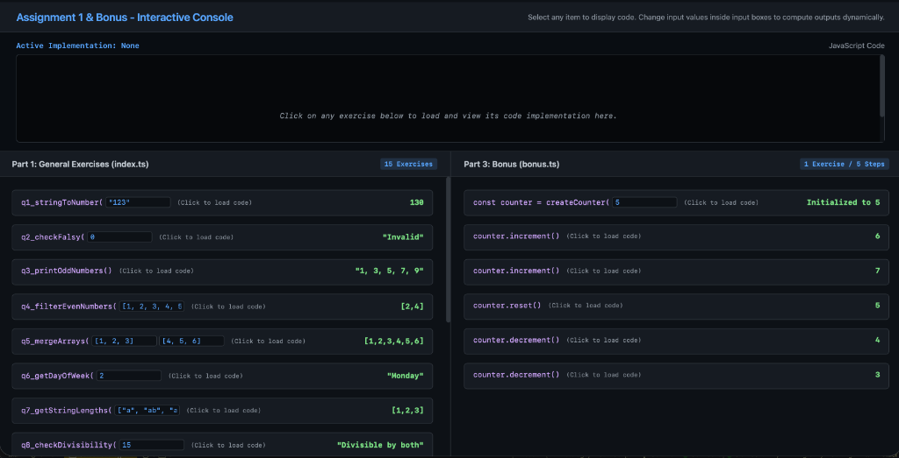

# Assignment 1: JavaScript & TypeScript Exercises

A structured, professional repository containing the complete solutions for **Assignment 1** (Part 1 Coding Tasks, Part 2 Essay Questions, and Part 3 Bonus Question). The project is written in pure **TypeScript** and executed natively using Node.js's built-in type-stripping engine—ensuring modern execution without producing compiled `.js` files.

---

## 📁 Repository Structure

```text
Assignment1/
├── package.json          # Dependency management and run scripts
├── tsconfig.json         # TypeScript configuration
├── index.ts              # Part 1: Solutions to the 15 coding exercises
├── essay.ts              # Part 2: Detailed solutions to the 5 essay questions
├── bonus.ts              # Part 3: LeetCode Counter II (Bonus)
├── index.test.ts         # Automated unit test suite (Vitest - 21 tests)
└── console-ui/           # Interactive Web Dashboard
    ├── console.html      # Main dashboard layout page (3-Column View)
    ├── console.css       # Dashboard styling
    ├── console.js        # Executable logic and mockup data
    └── console.png       # Dashboard preview screenshot
```

---

## ⚙️ Requirements & Installation

- **Node.js**: `v22.6.0` or higher (required for native TypeScript execution).

To set up the testing framework and local configurations, install the developer dependencies:
```bash
npm install
```

---

## 🚀 Execution Scripts

The repository contains scripts configured in [package.json](package.json) for seamless execution:

### 1. Run Coding Exercises (Part 1)
Executes [index.ts](index.ts) containing the 15 coding tasks.
```bash
npm start
```

### 2. Run Essay Questions (Part 2)
Executes [essay.ts](essay.ts) containing the 5 theoretical essay solutions and interactive console outputs.
```bash
npm run essay
```

### 3. Run LeetCode Bonus (Part 3)
Executes [bonus.ts](bonus.ts) containing the Counter II solution.
```bash
npm run bonus
```

### 4. Run Automated Tests
Runs the test suite inside [index.test.ts](index.test.ts) via Vitest. It validates all 15 coding exercises, 5 essay questions, and the bonus counter across 21 unit tests.
```bash
npm test
```

### 5. Open Interactive Console (Web UI)
Opens the interactive visual console [console-ui/console.html](console-ui/console.html) in your default web browser:
```bash
npm run console
```

---

## 🖥️ Interactive HTML Console Dashboard

We have provided a premium, fully interactive web dashboard to test all assignment functions in real-time.



### Features:
- **Interactive Inputs**: Modify input arguments (numbers, strings, arrays, objects) inside text fields and see outputs recalculate instantly.
- **Dynamic 3-Column View**: Multi-panel design separating [index.ts](index.ts) exercises on the left, [essay.ts](essay.ts) questions in the center, and [bonus.ts](bonus.ts) (Counter II) on the right.
- **Shared Code Viewer**: Click on any running exercise or essay question to instantly display its underlying JavaScript/TypeScript implementation loaded from [console-ui/console.js](console-ui/console.js) and styled by [console-ui/console.css](console-ui/console.css) in a dedicated syntax panel at the top.
- **Async Execution Support**: Real-time simulation of asynchronous promises (Q12), async try-catch error handling (Part 2 Q4), and stateful counters (Bonus Counter).

---

## 📝 Assignment Overview

### Part 1: Coding Tasks ([index.ts](index.ts))
1. **String to Number**: Convert `"123"` to a number and add `7`.
2. **Falsy Check**: Check if a variable is falsy and return `"Invalid"`.
3. **Continue Loop**: Print odd numbers from `1` to `10` using `continue`.
4. **Filter Evens**: Extract even numbers from an array using `Array.prototype.filter()`.
5. **Spread Merge**: Merge two arrays using the spread (`...`) operator.
6. **Day of Week**: Map numbers `1` to `7` to weekdays using a `switch` statement.
7. **Map Lengths**: Transform an array of strings into an array of lengths.
8. **Divisibility**: Check if a number is divisible by `3` and `5`.
9. **Arrow Square**: Return the square of a number using arrow syntax.
10. **Object Destructuring**: Destructure properties from a Person object.
11. **Sum Multiple**: Sum variable arguments using rest parameters.
12. **Promise Delay**: Return a promise that resolves with `"Success"` after `3` seconds.
13. **Array Maximum**: Find the largest number in an array.
14. **Object Keys**: Retrieve all keys of a given object.
15. **Split Words**: Split a string into words based on spaces.

---

### Part 2: Essay Questions ([essay.ts](essay.ts))

#### 1. Difference between `forEach` and `for...of` & Usage Scenarios
- **`forEach`**: An `Array.prototype` callback method. It executes a provided callback for each array element. It **does not support** early termination via `break`, `continue`, or `return` (returning from callback acts like `continue`), and does not handle `async/await` sequentially. Skips empty array slots.
- **`for...of`**: A language-level loop statement that iterates over any **Iterable** (Arrays, Strings, Maps, Sets, Generators). It fully supports `break`, `continue`, `return`, and sequential `await`. Iterates over sparse elements as `undefined`.
- **When to use**: Use `forEach` for functional, chainable array processing without early termination. Use `for...of` when control flow (`break`/`continue`/`await`) is required or when iterating over non-Array iterables.

#### 2. Hoisting & The Temporal Dead Zone (TDZ)
- **Hoisting**: JavaScript's compilation mechanism where variable and function declarations are moved in memory to the top of their containing scope prior to code execution.
  - `function` declarations are fully hoisted with their implementations.
  - `var` declarations are hoisted and initialized to `undefined`.
  - `let` and `const` declarations are hoisted into memory but remain uninitialized.
- **Temporal Dead Zone (TDZ)**: The time span between entering a scope and the actual line where a `let` or `const` variable is evaluated/initialized. Accessing a `let`/`const` variable in its TDZ throws a `ReferenceError`.

#### 3. Differences between `==` and `===`
- **`==` (Loose Equality)**: Compares two values AFTER performing **implicit type coercion** if operands are of different types (e.g., `"5" == 5` evaluates to `true`, `0 == false` evaluates to `true`).
- **`===` (Strict Equality)**: Compares both **value** AND **type** WITHOUT performing type coercion. If operand types differ, it immediately returns `false` (e.g., `"5" === 5` evaluates to `false`).
- **Best Practice**: Always use strict equality (`===`) to maintain type safety and avoid subtle coercion bugs, except when explicitly checking for nullish values (`val == null` checks both `null` and `undefined`).

#### 4. `try-catch` Mechanics & Importance in Async Operations
- **`try-catch` Mechanism**: Code that might throw an exception is wrapped in the `try` block. If an error is thrown, control jumps to `catch` with the error object. The optional `finally` block runs regardless of success or failure.
- **Async Importance**: Asynchronous operations (network requests, API calls, file I/O) can fail due to external runtime conditions. When using `async/await`, rejected promises throw exceptions asynchronously. Wrapping `await` calls in `try-catch` enables developers to handle rejected promises synchronously in code context, preventing process crashes and enabling graceful error fallbacks.

#### 5. Type Conversion vs Type Coercion
- **Type Conversion (Explicit)**: Deliberate type casting performed intentionally by the developer using built-in constructors/functions (e.g., `Number("42")`, `String(100)`, `Boolean(1)`).
- **Type Coercion (Implicit)**: Automatic type casting performed implicitly by JavaScript during operations with mixed types or truthiness evaluations (e.g., `"The answer is " + 42` coercing 42 to string, `"10" - 5` coercing `"10"` to number 10).

---

### Part 3: Bonus Question ([bonus.ts](bonus.ts))
- **LeetCode 2665 (Counter II)**: TypeScript implementation of a stateful counter closure exporting `increment()`, `decrement()`, and `reset()` methods.
